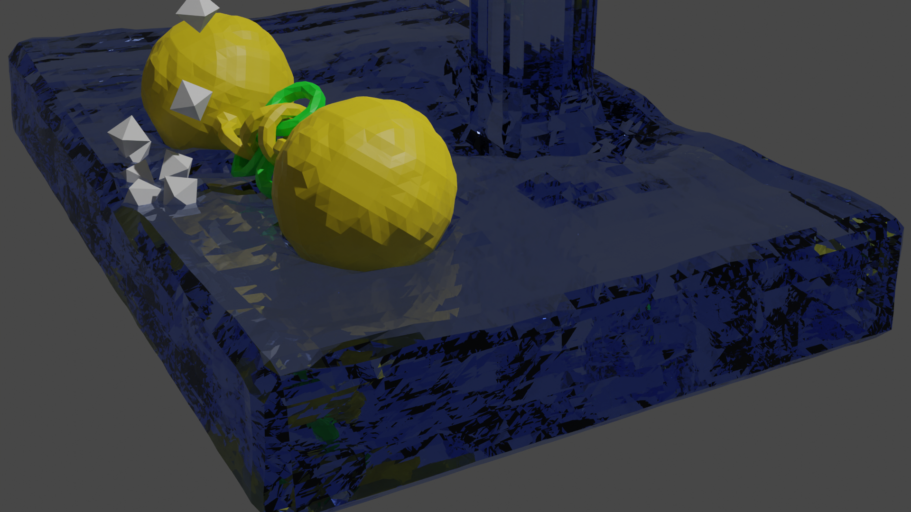
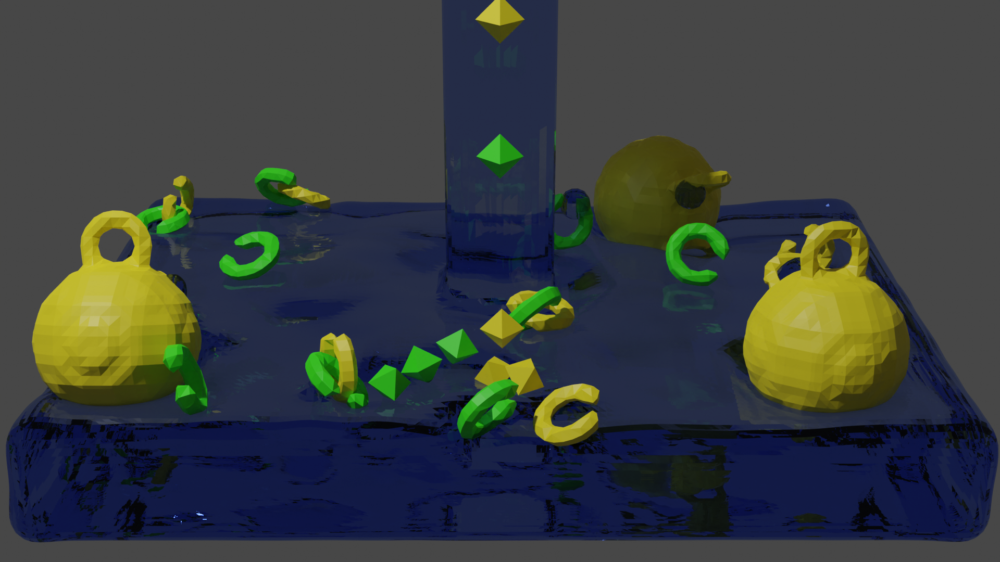

# 2023-ACG-Final-Project

It's the final project of the course Advanced Computer Graphics 2023.

I implement a SPH simulator. Some results are below:

The code should be run in the root directory.

Due to some parameters in the code being fixed for specific scenarios, running it directly may not yield the expected results.